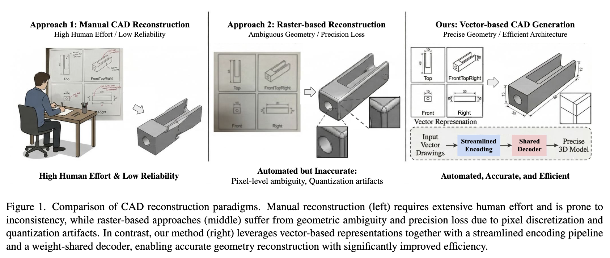

<div align="center">

# SwiftCAD: Efficient Parametric CAD Generation with Shared Decoder Transformers

<h4>
  Juyoung Kim<sup>1*</sup>
  ·
  Seongjun Choi<sup>2*</sup>
  ·
  Jiyeon Lim<sup>3</sup>
  ·
  Wongi Park<sup>4</sup>
  ·
  Soomok Lee<sup>5</sup>
</h4>

<h5>
  <sup>1</sup>Metacle  <sup>2</sup>Yonsei University  <sup>3</sup>Samsung Electronics  <br><sup>4</sup>Ajou University  <sup>5</sup>Kennesaw State University
</h5>

<h4>
  CVPR 2026 Workshop 3D4S
</h4>

<h5>
  *Equal contribution.
</h5>

[]()
[](https://jadekim042386.github.io/SwiftCAD/)
[](https://drive.google.com/drive/folders/1t9uO2iFh1eVDXRCKUEonKPBu8WGYA8wU?usp=sharing)

</div>



SwiftCAD is a streamlined Transformer architecture for parametric CAD generation from vector engineering drawings, building on the SVG-based pipeline of Drawing2CAD. By removing redundant MLP layers in the embedding stage and unifying command and parameter prediction into a single weight-shared decoder with task-specific heads, SwiftCAD achieves a **64.74% reduction in parameters** (from 10.1M to 3.6M) and faster inference, while maintaining accuracy within 0.5% (command) and 0.9% (parameter) of the Drawing2CAD baseline on the CAD-VGDrawing benchmark.

## 🐍 Installation

- Python 3.9
- Cuda 11.8+

Install python package dependencies through pip:

```bash
pip install -r requirements.txt
```

## 📥 Dataset

We use the **CAD-VGDrawing** dataset from Drawing2CAD. Download data from [here](https://drive.google.com/drive/folders/1t9uO2iFh1eVDXRCKUEonKPBu8WGYA8wU?usp=sharing) and extract them under the `data` folder.

- `svg_raw` contains the engineering drawings of each CAD model in SVG format, including four views: `Front`, `Top`, `Right`, and `FrontTopRight`. Each SVG file has been preprocessed through path simplification and deduplication, path reordering, and viewbox normalization. To obtain engineering drawings in PNG format, you can simply convert them using [CairoSVG](https://cairosvg.org/) with a single line of code:

  ```python
  import cairosvg
  
  cairosvg.svg2png(url=svg_path, write_to=png_path, output_width=224, output_height=224, background_color='white')
  ```

- `svg_vec` contains vectorized representations of SVG drawing sequences. Each file stores the stacked drawing sequences for the four views (`Front`, `Top`, `Right`, and `FrontTopRight`), saved in `.npy` format to enable fast data loading.

- `cad_vec` contains the vectorized representation for CAD sequences, saved in `.h5` format to enable fast data loading.

## 🚀 Training

The main SwiftCAD configuration (Shared Decoder + no MLP embedding, `d_model=144`) can be trained with:

```bash
python train.py --input_option 4x --d_model 144 --exp_name swiftcad_main
```

To reproduce all five rows of Table 2, use the following commands. The relevant flags are:

- `--use_shared_decoder` (default: on) — shared decoder architecture (paper main). Pass `--no-use_shared_decoder` to use the dual-decoder baseline.
- `--use_mlp_embedding` (default: off) — pass to enable the legacy MLP embedding layer (Drawing2CAD baseline).
- `--d_model` (default: `144`, choices: `144` / `192` / `256`) — Transformer embedding dimension.

```bash
# (1) Baseline (Drawing2CAD): dual decoder + MLP embedding
python train.py --input_option 4x --no-use_shared_decoder --use_mlp_embedding --d_model 256 --exp_name baseline

# (2) Shared Decoder only (with MLP embedding)
python train.py --input_option 4x --use_mlp_embedding --d_model 256 --exp_name shared_decoder

# (3) Shared + w/o MLP, d_model = 144  (main config)
python train.py --input_option 4x --d_model 144 --exp_name shared_nomlp_144

# (4) Shared + w/o MLP, d_model = 192
python train.py --input_option 4x --d_model 192 --exp_name shared_nomlp_192

# (5) Shared + w/o MLP, d_model = 256
python train.py --input_option 4x --d_model 256 --exp_name shared_nomlp_256
```

Since different configurations produce different model checkpoints, it is recommended to specify a unique `--exp_name` for each run. For more configurable parameters, please refer to `config/config.py`.

## 📍 Evaluation

After training, run inference on all test data with the corresponding configuration. Make sure the inference flags match the training flags.

```bash
# (1) Baseline (Drawing2CAD)
python test.py --input_option 4x --no-use_shared_decoder --use_mlp_embedding --d_model 256 --exp_name baseline

# (2) Shared Decoder only
python test.py --input_option 4x --use_mlp_embedding --d_model 256 --exp_name shared_decoder

# (3) Shared + w/o MLP, d_model = 144  (main config)
python test.py --input_option 4x --d_model 144 --exp_name shared_nomlp_144

# (4) Shared + w/o MLP, d_model = 192
python test.py --input_option 4x --d_model 192 --exp_name shared_nomlp_192

# (5) Shared + w/o MLP, d_model = 256
python test.py --input_option 4x --d_model 256 --exp_name shared_nomlp_256
```

After inference, the final results will be saved under `proj/your_exp_name/test_results`. To evaluate the model inference results and to export and visualize the final CAD models, please refer to the code from [DeepCAD](https://github.com/ChrisWu1997/DeepCAD).

## 📊 Results

Quantitative comparison on CAD-VGDrawing (Table 2 of the paper). All entries use the `4x` input option.

| Method | Parameters | File Size (MB) | Inf. Time (s) | ACC<sub>cmd</sub> | ACC<sub>param</sub> |
|---|---:|---:|---:|---:|---:|
| Baseline (Drawing2CAD) | 10,109,894 | 38.57 | 8.4815 | 82.76 | 79.23 |
| Shared Decoder | 7,722,438 | 29.46 | 8.4329 | 82.42 | 79.13 |
| **Shared + w/o MLP (144)** | **3,564,806** | **13.60** | **7.7575** | 82.37 | 78.55 |
| Shared + w/o MLP (192) | 5,204,234 | 19.85 | 8.4447 | 82.17 | 78.87 |
| Shared + w/o MLP (256) | 7,745,850 | 29.55 | 8.3925 | 82.20 | 79.21 |

The two contributions are complementary. The **shared decoder** alone removes ~24% of the parameters by replacing the dual command/parameter decoders with a single weight-shared decoder and task-specific output heads. Stacking the **streamlined encoding** (removing the embedding-stage MLP, letting Transformer self-attention alone capture cross-field interactions between view, command, and parameter tokens) and reducing `d_model` to 144 yields the main config: a 64.74% parameter reduction, the smallest file size, and the fastest inference, while staying within 0.5% of the baseline on command accuracy and 0.9% on parameter accuracy.

## 🌹 Acknowledgement

This repository builds upon the following awesome datasets and projects:

- [Drawing2CAD](https://arxiv.org/abs/2508.18733) (Qin et al., 2025)
- [DeepCAD](https://github.com/ChrisWu1997/DeepCAD)
- [FreeCAD](https://github.com/FreeCAD/FreeCAD)
- [CairoSVG](https://cairosvg.org/)

## 📝 Citation

If you find this project useful for your research, please use the following BibTeX entry.

```
@inproceedings{kim2026swiftcad,
  title={SwiftCAD: Efficient Parametric CAD Generation with Shared Decoder Transformers},
  author={Juyoung Kim and Seongjun Choi and Jiyeon Lim and Wongi Park and Soomok Lee},
  booktitle={Proceedings of the IEEE/CVF Conference on Computer Vision and Pattern Recognition Workshops (CVPRW)},
  year={2026}
}
```

(BibTeX will be updated once camera-ready proceedings are published.)
