# Drawing2CAD 아키텍처 개선 연구 — 최종 보고서

**프로젝트 기간**: 2026-04-14 ~ 2026-04-18 (5일)
**담당**: AI 엔지니어 (메타클, 2D 파이프 라우팅 모델 학습 팀)
**하드웨어**: NVIDIA A100-SXM4-80GB × 1
**소프트웨어**: PyTorch 2.7.0, CUDA 12.8, pythonocc-core 7.5.1
**데이터셋**: Drawing2CAD test set (7,881 샘플)
**학습 설정**: 200 epochs (MP: 70 epochs), batch_size=256, lr=1e-3 (MP: 5e-4), input_option=4x

---

## 요약 (Executive Summary)

본 연구는 Drawing2CAD의 두 가지 구조적 병목(Decoder mean-pool bottleneck, Custom-MHA로 인한 compile/SDPA 불가)을 해결하고, 이후 Mask-Predict 기반 iterative refinement 및 3D OCC 복원 기반 평가 파이프라인을 도입하여 모델을 정량/정성 측면에서 재평가했다. 핵심 결과는 다음과 같다.

- **아키텍처 (Phase 2)**: Alternating Attention Encoder + Cross-Attention Decoder 조합인 **Variant (e)** 가 Baseline 대비 **Cmd +0.81%p, Avg Args +0.68%p** 로 최고 정확도를 기록했다. 디코더/인코더 단독 개선보다 조합 시 Args에 약한 시너지가 관찰된다 (+0.68 > 0.22 + 0.35).
- **추론 최적화 (Phase 3)**: torch.compile(reduce-overhead) + FP16을 (e)에 적용하여 batch=1 latency를 **6.876ms → 1.251ms (5.19× speedup)**, Baseline (a) FP32 대비 **3.14× 더 빠른** 추론을 달성했다. argmax 일치율은 99.99%로 정확도 손실은 사실상 없다.
- **Mask-Predict (Phase 4.1)**: N=0 (refinement 미사용, MP 학습 regime만) 가 variant (e) 대비 Avg Args **+0.31%p (79.33 → 79.64)**, IR **29.47% → 29.95% (2000 subset 기준 최저)**, CD Trimmed **0.0537 → 0.0525 (−2.2%)** 로 regularizer 역할을 한다. 그러나 iterative refinement (N≥1) 은 Cmd Acc 48.42%까지 붕괴하며 IR이 95%+ 폭증하여 실용 불가.
- **3D 구조 유효성 (전체 7,881 샘플)**: 5개 variant 모두 IR 28~30% 수준이며, (d) Alt-Attn이 28.13%로 최저. Token accuracy 1위 (e) 와 IR 1위 (d) 가 서로 다르다. 이는 Args 개선이 반드시 BRep validity 향상으로 이어지지 않음을 보여준다.
- **핵심 교훈**: Cmd 한 토큰 오차가 "3D 있음/없음" 이진 격차로 증폭되는 케이스 (`00868771`) 가 존재하는 반면, Args 개선이 형상 의미 (semantic) 를 파괴하는 회귀 케이스 (`00319566`) 도 존재한다. 숫자 metric 이 가리는 structural validity 차원의 병목 (pred 약 22% 는 OCC 변환 실패) 이 향후 핵심 개선 타겟이다.

---

## 1. 연구 배경

### 1.1 기존 Drawing2CAD의 한계

분석 결과 세 가지 근본 병목이 식별되었다.

1. **Decoder 정보 병목**: Encoder 출력 `(300, N, 144)` (43,200 값) 이 mean pooling 으로 단일 벡터 `(1, N, 144)` 로 압축 (300:1 압축비) 되어, 모든 60개 decoder 위치에 동일하게 broadcast 된다. 출력에 필요한 최소 정보량 (~7,835 bits) 이 144 float32 벡터의 정보 용량 (~4,608 bits) 을 초과한다.
2. **Custom MHA 로 인한 최적화 봉쇄**: `functional.py:90,94` 의 `torch.equal(query, key)` 와 explicit `torch.bmm` 때문에 PyTorch SDPA 백엔드 및 `torch.compile` 사용이 불가능하다. 이로 인해 모델이 compute-bound 가 아닌 **overhead-bound** (CUDA 커널 런칭 오버헤드 ~75+ 커널 × 5-15μs) 이다.
3. **NAT decoder 의 sequence length 60 고정**: 긴 CAD 시퀀스 (30+) 에서 첫 토큰 오류가 연쇄 붕괴를 유발한다.

### 1.2 연구 가설

- **H1**: Cross-Attention Decoder 로 mean-pool 병목을 제거하면 각 decoder 위치가 관련 SVG stroke 에 선택적으로 attend 하여 Command/Args 정확도가 향상된다.
- **H2**: Alternating Attention Encoder (VGGT-style frame-wise/global 교대) 가 multi-view geometric 대응관계를 명시적으로 모델링하여 extrude 파라미터 (plane/trans/extent) 정확도에 기여한다.
- **H3**: nn.MultiheadAttention 전환 후 torch.compile(reduce-overhead) + FP16 조합이 kernel launch overhead 를 CUDA Graph 로 제거하여 Phase 2 의 latency 증가를 상쇄한다.
- **H4**: Mask-Predict iterative refinement 가 저신뢰 토큰을 선택적으로 재예측하여 특히 Args 정확도에 추가 이득을 제공한다.

---

## 2. 방법론

### 2.1 Phase 1: Custom MHA → nn.MultiheadAttention 전환

`model/layers/functional.py` 및 custom `MultiheadAttention` 을 제거하고 `nn.MultiheadAttention` 으로 대체했다. PyTorch 2.7.0의 SDPA 백엔드가 자동 선택되며 `torch.equal` 기반 graph break 가 사라진다.

- **주의사항 해결**: key_padding_mask convention (`True=무시`) 동일, need_weights 는 visualization 전용으로 분리.
- **Baseline 재현성 영향**: 논문 원본 대비 Cmd -0.79%p, Args -0.58%p 하락 (표 3.4 참조). scratch 재학습으로 발생한 차이이므로 아키텍처 개선 효과는 이 baseline 을 기준으로 해석한다.

### 2.2 Phase 2: 아키텍처 Variants

5개 variant 를 설계하여 두 방법론의 개별 기여와 조합 효과를 분리 측정했다.

| Variant | Encoder | Decoder | Bottleneck | 설계 의도 |
|---|---|---|---|---|
| (a) Baseline | Standard | Broadcast | Mean pool | 기준선 (nn.MHA 전환 후 재학습) |
| (b) Cross-Attn | Standard | Cross-Attention | 제거 | 디코더 개선 단독 효과 |
| (c) Cross-Attn+BN | Standard | Cross-Attention | Element-wise | Bottleneck 유무 비교 |
| (d) Alt-Attn | Alternating | Broadcast | Mean pool | 인코더 개선 단독 효과 (Negative Control) |
| (e) Alt+Cross | Alternating | Cross-Attention | 제거 | 인코더 + 디코더 동시 개선 |

**모델 규모**:

| Variant | Parameters | Size (MB) | vs Baseline |
|---|:---:|:---:|:---:|
| (a) Baseline | 7,679,930 | 29.30 | — |
| (b) Cross-Attn | 8,471,482 | 32.32 | +10.3% |
| (c) Cross-Attn+BN | 8,537,402 | 32.57 | +11.2% |
| (d) Alt-Attn | 9,711,546 | 37.05 | +26.5% |
| (e) Alt+Cross | 10,503,098 | 40.07 | +36.8% |

**Alternating Attention Reshape** (view 블록이 연속 100 토큰인 구조 활용):

```python
# Frame-wise: (300, N, D) → (100, 3*N, D)
x = x.view(3, 100, N, D)
x = x.permute(1, 0, 2, 3)
x = x.reshape(100, 3*N, D)

# Global attention: 원본 (300, N, D) 유지
# PE 분리: Intra-view PE (0-99) + View Embedding (0-2)
```

**Cross-Attention Decoder**:
- Encoder 반환값: `z (1, N, 144)` → `(memory (S, N, 144), key_padding_mask (N, S))`
- `TransformerDecoderLayerGlobalImproved` → `TransformerDecoderLayerImproved` 교체
- mean pooling + linear_global 제거, `multihead_attn(tgt, memory, memory, memory_key_padding_mask)` 로 대체

### 2.3 Phase 3: 추론 최적화

**대상**: Variant (e) Alt+Cross
**전략**: torch.compile(mode="reduce-overhead") + FP16 autocast

Graph break 분석 결과 `input_option=4x` 고정 시 forward path 에 실질적 break 없음을 확인:

| 파일 | 패턴 | 심각도 | 상태 |
|---|---|---|---|
| `functional.py:90,94` | `torch.equal(query, key)` | CRITICAL | 미사용 (nn.MHA 전환 완료) |
| `model.py:83` | `if S == self.tokens_per_view` | HIGH | 4x 고정 시 상수 |
| `model.py:91-93` | `for v in range(num_views)` | HIGH | 4회 고정 루프 |
| `trainer.py:80,107` | `.cpu().numpy()` | MEDIUM | forward 외부 |

CUDA Graph 호환성을 위해 data-dependent control flow (`.item()`, `.nonzero()`, 텐서 값 기반 `if`) 가 forward path 에 없음을 전수 확인했다.

### 2.4 Phase 4.1: Mask-Predict Iterative Refinement

CMLM (Ghazvininejad et al., EMNLP 2019) 방식을 NAT decoder 에 접목.

**새 모듈 `PartialPredictionEmbedding`** (model/model.py +112~151 lines, +19,600 params):
- 1차 예측: 기존 ConstEmbedding (zeros + PE) 사용
- 2차+ 예측: `(prev_cmd, prev_args)` embed + 저신뢰 위치에 learnable `[MASK]` 토큰 주입

**학습 전략**:
- Variant (e) pretrained checkpoint (`proj_log/variant_e_alt_cross_4x/model/latest.pth`) 로드 (`strict=False`) → 70 epochs fine-tuning (lr=5e-4, batch=256)
- Step 마다 `Uniform(0.15, 0.85)` 로 mask_ratio 샘플링, GT 를 prev_prediction 으로 사용
- Loss = initial pass + refinement pass (masked positions only, `padding_mask *= refinement_mask.float()`)

**추론 전략**:
- 1차 예측 → `torch.topk(cmd_confidence, k, largest=False)` 로 저신뢰 k 위치 마스킹 → decoder 재실행 → N step 반복
- Mask schedule: N=1 `[0.5]`, N=2 `[0.5, 0.3]`, N=3 `[0.6, 0.4, 0.2]`

**총 학습 시간**: 5시간 55분 (70 epochs 완주)

### 2.5 3D OCC 기반 평가 파이프라인

**목적**: Token accuracy 가 놓치는 "3D 형상으로 복원 가능한가" 를 직접 측정.

**파이프라인**:
1. 테스트 결과 `_vec.h5` → DeepCAD `cadlib.visualize.vec2CADsolid` → `TopoDS_Shape`
2. `BRepCheck_Analyzer.IsValid()` 로 BRep 유효성 판정
3. `xvfb-run` + Viewer3d offscreen 렌더 (4 등각 시점, 512×512 PNG)
4. STL export → trimesh surface sampling (2000 points, seed=0) → Chamfer Distance (KDTree, joblib n_jobs=8)

**DeepCAD 통합 패치** (`cadlib_deepcad/`):
- `curves.py`, `extrude.py`: `np.int` → `int` (NumPy 1.24+ deprecation)
- `sketch.py`: `matplotlib.use('TkAgg')` → `'Agg'` (headless/xvfb 호환)

---

## 3. 정량 평가

### 3.1 Command / Argument Accuracy (Tolerance=3)

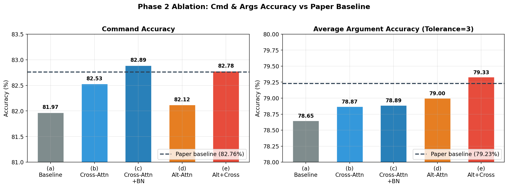

**5 variants + MP N=0..3 통합**:

| Metric | 논문 원본 | (a) | (b) | (c) | (d) | (e) | MP N=0 | MP N=1 | MP N=2 | MP N=3 |
|---|:---:|:---:|:---:|:---:|:---:|:---:|:---:|:---:|:---:|:---:|
| **Cmd Acc** | **82.76** | 81.97 | 82.53 | 82.89 | 82.12 | 82.78 | **82.61** | 48.42 | 43.48 | 39.21 |
| line | — | 69.49 | 70.38 | 70.48 | 70.83 | 70.77 | 71.46 | 60.41 | 51.92 | 52.57 |
| arc | — | 79.80 | 79.20 | 80.27 | 79.22 | 79.25 | 79.43 | 65.52 | 62.20 | 62.61 |
| circle | — | 92.58 | 92.83 | 92.08 | 91.77 | 92.72 | 93.05 | 93.37 | 80.29 | 83.66 |
| plane | — | 93.74 | 93.54 | 93.60 | 94.12 | 94.52 | 94.34 | **96.67** | 91.29 | 89.20 |
| trans | — | 70.06 | 70.11 | 69.64 | 70.41 | 70.58 | 70.75 | **80.14** | 57.60 | 60.89 |
| extent | — | 66.19 | 67.16 | 67.30 | 67.61 | 68.14 | 68.78 | **79.80** | 53.71 | 58.19 |
| **Avg Args** | **79.23** | 78.65 | 78.87 | 78.89 | 79.00 | 79.33 | **79.64** | 79.32 | 66.17 | 67.85 |

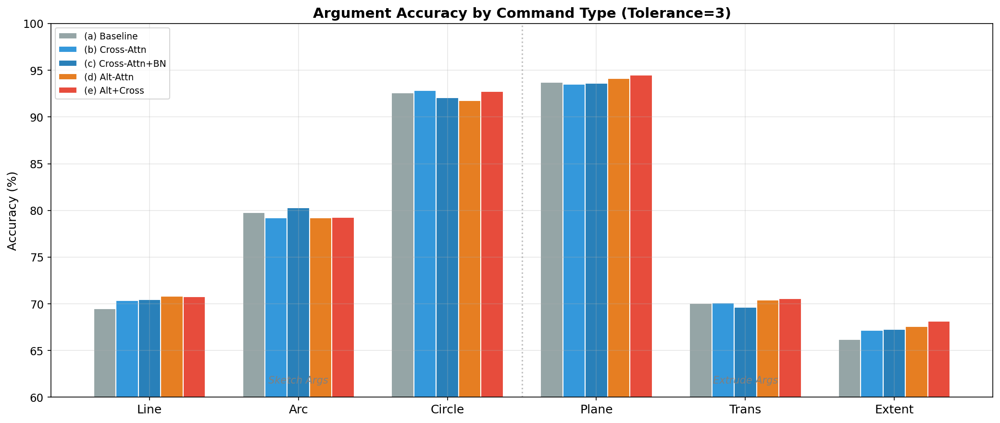

**주요 관찰**:
- (e) Alt+Cross 가 Phase 2 variant 중 Avg Args 최고 (+0.68 vs (a))
- MP N=0 가 Avg Args 전체 최고 (79.64%), plane 제외 모든 항목에서 (e) 를 상회
- N=1 에서 plane/trans/extent 가 비약적 상승 (plane 94.52→96.67, trans 70.58→80.14, extent 68.14→79.80) — 단, Cmd Acc 붕괴 (48.42%) 로 상쇄

### 3.2 Exact Match Accuracy (Tolerance=0)

| Metric | (a) | (b) | (c) | (d) | (e) |
|---|:---:|:---:|:---:|:---:|:---:|
| line | 63.55 | 64.19 | 64.13 | 64.53 | 64.32 |
| arc | 69.49 | 69.25 | 70.55 | 68.33 | 69.29 |
| circle | 84.61 | 84.60 | 84.13 | 83.54 | 84.61 |
| plane | 93.12 | 92.97 | 92.97 | 93.49 | **93.88** |
| trans | 63.38 | 63.24 | 62.76 | 63.36 | **63.80** |
| extent | 52.76 | 53.30 | 52.93 | 53.01 | **53.81** |
| **Avg** | 71.15 | 71.26 | 71.25 | 71.05 | **71.62** |

### 3.3 Mean Absolute Error (MAE, Lower is Better)

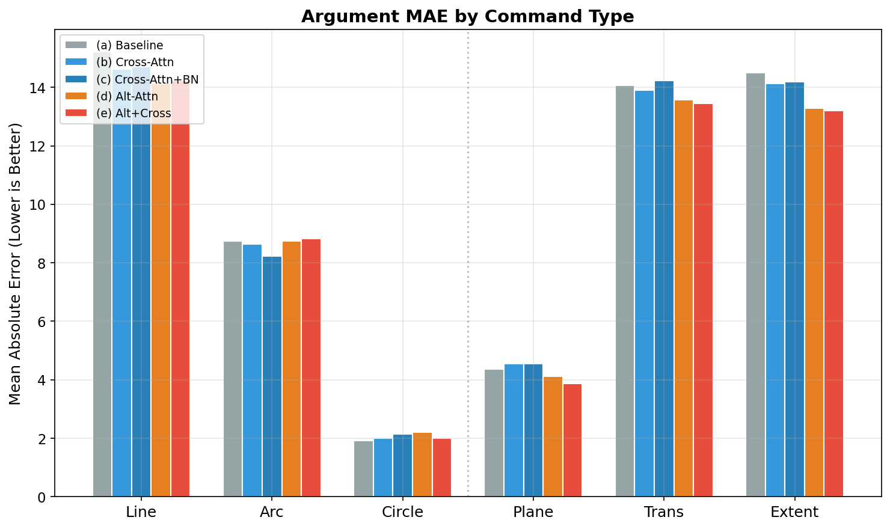

| Metric | (a) | (b) | (c) | (d) | (e) |
|---|:---:|:---:|:---:|:---:|:---:|
| line | 15.217 | 14.619 | 14.711 | **14.129** | 14.235 |
| arc | 8.753 | 8.638 | **8.238** | 8.734 | 8.819 |
| circle | **1.927** | 1.998 | 2.140 | 2.200 | 1.993 |
| plane | 4.372 | 4.548 | 4.556 | 4.122 | **3.863** |
| trans | 14.066 | 13.904 | 14.237 | 13.566 | **13.450** |
| extent | 14.491 | 14.126 | 14.182 | 13.280 | **13.203** |
| **Avg** | 9.804 | 9.639 | 9.677 | 9.339 | **9.261** |

### 3.4 논문 원본 대비 차이 (Delta)

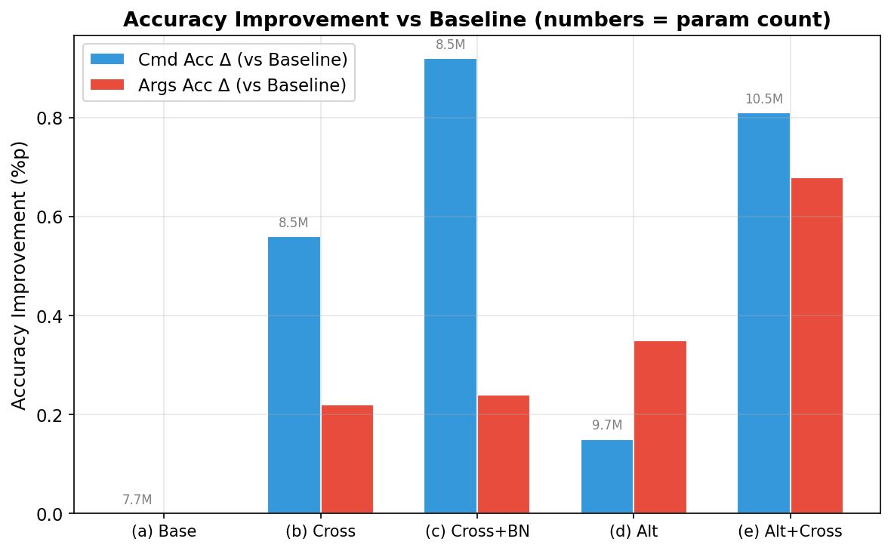

| Metric | (a) | (b) | (c) | (d) | (e) |
|---|:---:|:---:|:---:|:---:|:---:|
| **Cmd Acc** | -0.79 | -0.23 | +0.13 | -0.64 | +0.02 |
| **Avg Args** | -0.58 | -0.36 | -0.34 | -0.23 | **+0.10** |

**Baseline(a) 기준 상대 개선폭**:

| Variant | Cmd Acc (vs a) | Avg Args (vs a) |
|---|:---:|:---:|
| (b) Cross-Attn | +0.56 | +0.22 |
| (c) Cross-Attn+BN | +0.92 | +0.24 |
| (d) Alt-Attn | +0.15 | +0.35 |
| (e) Alt+Cross | **+0.81** | **+0.68** |

### 3.5 3D 복원 성공률 / Invalidity Ratio (전체 7,881 샘플)

전체 test set 에 대해 OCC 변환 성공/실패 집계 (`success_variant_*.json` 기반):

| Config | Conv OK | OK Ratio | BRep valid | Valid Ratio | **IR (BRep-invalid)** |
|---|:---:|:---:|:---:|:---:|:---:|
| (a) Baseline | 6,140 | 77.91% | 5,550 | 70.42% | 29.58% |
| (b) Cross-Attn | 6,177 | 78.38% | 5,604 | 71.11% | 28.89% |
| (c) Cross-Attn+BN | 6,183 | 78.45% | 5,579 | 70.79% | 29.21% |
| (d) Alt-Attn | **6,213** | **78.84%** | **5,664** | **71.87%** | **28.13%** |
| (e) Alt+Cross | 6,138 | 77.88% | 5,558 | 70.52% | 29.47% |
| GT | 7,759 | 98.45% | 7,687 | 97.54% | 2.46% |

**실패 원인 분포 (pred)**:

| 원인 | (a) | (b) | (c) | (d) | (e) | 의미 |
|---|:---:|:---:|:---:|:---:|:---:|---|
| AssertionError | 864 | 860 | 927 | 814 | 933 | SOL 시작 가정·인덱싱 전제 위반 |
| IndexError | 662 | 617 | 580 | 630 | 541 | EXT 참조 실패 또는 sketch loop 미닫힘 |
| RuntimeError | 212 | 226 | 189 | 222 | 268 | OCC boolean op / `BRepAlgoAPI_*` 실패 |
| NullShape / Other | 3 | 1 | 2 | 2 | 1 | vec2CADsolid Null 반환 |

**해석**:
- 모든 variant 에서 pred 의 약 22% 가 OCC 변환 자체를 실패 — Cmd 82% / Args 79% 라는 숫자 지표가 가리는 structural validity 갭 (약 27%p)
- (e) 는 (a) 대비 AssertionError (+69), RuntimeError (+56) 증가, IndexError (-121) 감소 — cross-attention 이 sketch 내부 구조는 더 잘 예측하나 SOL/EXT 전역 순서에는 동등하거나 fragile
- (d) 가 IR 28.13% 로 최저 — Alternating encoder 의 multi-view feature 가 extrude 구조 정합성에 기여

### 3.6 Chamfer Distance (2000 random samples, seed=0)

`tools/eval_cd_ir.py` 로 9개 config 동시 평가.

| Config | n_valid | IR (↓) | CD Mean (↓) | CD Median (↓) | CD Trimmed Mean (↓) |
|---|:---:|:---:|:---:|:---:|:---:|
| (a) Baseline | 1371 | 0.3145 | 0.1176 | 0.00729 | 0.0575 |
| (b) Cross-Attn | 1390 | 0.3050 | 0.1109 | 0.00867 | 0.0583 |
| (c) Cross-Attn+BN | 1376 | 0.3120 | 0.1138 | 0.00622 | 0.0591 |
| (d) Alt-Attn | **1390** | **0.3050** | **0.1027** | 0.00603 | 0.0548 |
| (e) Alt+Cross | 1373 | 0.3135 | 0.1077 | 0.00619 | **0.0537** |
| **MP N=0** | **1401** | **0.2995** | 0.1058 | **0.00541** | **0.0525** |
| MP N=1 | 83 | 0.9585 | 0.0406† | 0.00147† | 0.00443† |
| MP N=2 | 0 | 1.0000 | N/A | N/A | N/A |
| MP N=3 | 24 | 0.9880 | 0.0980† | 0.01405† | 0.04919† |

† MP N≥1 의 CD 수치는 IR 이 95% 이상이라 극소수 유효 샘플만 반영되어 신뢰성 낮음. MP N=2는 단 1 샘플도 살아남지 못함.

**MP N≥1 에서 IR 폭증 원인**: `pred:convert:IndexError` 가 압도적 (N=1: 1831/2000, N=2: 1459/2000, N=3: 1822/2000). Mask-predict refinement 가 vec→OCC 변환 단계의 인덱스 경계 (SOL/EXT 매칭) 를 깨뜨린다.

**해석**:
- Phase 2 variant 의 IR 은 30~31% 수준으로 수렴 — CAD sequence 의 **구조적 유효성은 아키텍처 변화에 둔감**
- MP N=0 가 유일하게 IR < 30% (29.95%) 달성, CD 모든 지표에서 최저
- (e) 는 Phase 2 variant 중 CD Trimmed Mean 0.0537 로 최저 — args 정확도 개선이 실제 3D 형상 근접도에 반영됨
- CD median (0.005) 과 mean (0.1) 의 큰 격차 → 소수의 대형 오류 샘플이 평균을 끌어올림. 하위 성능 샘플의 구조적 실패와 일치

### 3.7 추론 Latency

**batch_size=1, A100 (Phase 2)**:

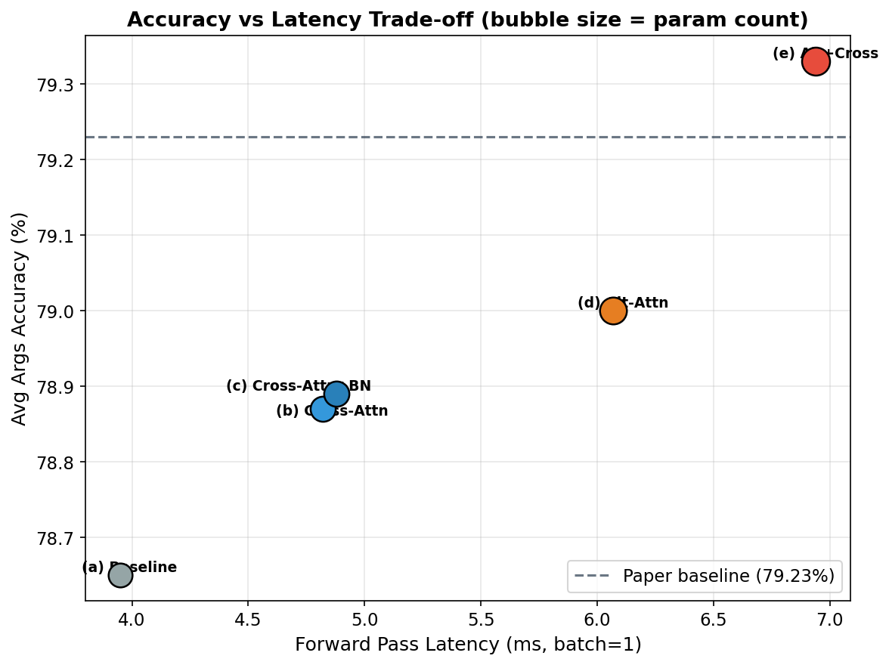

| Variant | Latency (ms) | vs Baseline |
|---|:---:|:---:|
| (a) Baseline | 3.95 ± 0.27 | — |
| (b) Cross-Attn | 4.82 ± 0.23 | +22.0% |
| (c) Cross-Attn+BN | 4.88 ± 0.08 | +23.5% |
| (d) Alt-Attn | 6.07 ± 0.09 | +53.7% |
| (e) Alt+Cross | 6.94 ± 0.09 | +75.7% |

**Phase 3 최적화 (batch_size=1)**:

| 설정 | Latency (ms) | Speedup (vs 자체 base) | vs (a) Baseline FP32 |
|---|:---:|:---:|:---:|
| (a) Baseline FP32 (no compile) | 3.925 | — | 1.00× |
| (e) FP32 (no compile) | 6.876 | — | 0.57× |
| (e) FP16 autocast only | 9.344 | 0.74× | 0.42× |
| (e) torch.compile (default) FP32 | 3.475 | 1.99× | 1.13× |
| (e) torch.compile (reduce-overhead) FP32 | 1.569 | 4.41× | 2.50× |
| (e) torch.compile (default) + FP16 | 4.301 | 1.61× | 0.91× |
| **(e) compile (reduce-overhead) + FP16** | **1.251** | **5.19×** | **3.14×** |

**배치 크기별**:

| Batch | 설정 | Latency | Throughput | Speedup |
|:---:|---|:---:|:---:|:---:|
| 1 | (e) Baseline FP32 | 6.876 ms | 145/s | 1.00× |
| 1 | (e) compile+FP16 | 1.251 ms | 799/s | **5.50×** |
| 16 | (e) Baseline FP32 | 7.240 ms | 2,210/s | 1.00× |
| 16 | (e) compile+FP16 | 2.897 ms | 5,523/s | 2.50× |
| 256 | (e) Baseline FP32 | 60.446 ms | 4,235/s | 1.00× |
| 256 | (e) compile+FP16 | 29.713 ms | 8,616/s | 2.03× |

**Phase 4.1 MP N별 (batch_size=1, A100, FP32, no compile)**:

| N | Mask schedule | Latency (ms) | vs N=0 | vs (a) Baseline |
|---|---|:---:|:---:|:---:|
| 0 | null | 6.95 ± 0.22 | 1.00× | +76% |
| 1 | [0.5] | 10.13 ± 0.11 | 1.46× | +158% |
| 2 | [0.5, 0.3] | 13.32 ± 0.30 | 1.92× | +239% |
| 3 | [0.6, 0.4, 0.2] | 16.50 ± 0.35 | 2.37× | +320% |

각 refinement step 당 약 +3.2 ms (decoder 재실행 1회 비용).

### 3.8 정확도 보존 검증 (Phase 3)

| 비교 대상 | command_logits max diff | args_logits max diff | Cmd argmax 일치율 |
|---|:---:|:---:|:---:|
| compile FP32 vs Baseline FP32 | 0.018 | 0.105 | 99.99% |
| compile FP16 vs Baseline FP32 | 0.025 | 0.204 | 99.99% |

FP16 정밀도 범위 내 오차이며 argmax 결과에 실질 영향 없음.

### 3.9 학습 리소스 및 Validation Loss

**Validation Loss (학습 종료 시점)**:

| Metric | (a) | (b) | (c) | (d) | (e) |
|---|:---:|:---:|:---:|:---:|:---:|
| val/loss_cmd | **1.178** | 1.166 | 1.297 | 1.397 | 1.285 |
| val/loss_args | 4.539 | **4.539** | 4.594 | 4.730 | 4.593 |

**학습 시간 (A100 80GB)**:

| Variant | 총 시간 | Epoch 당 |
|---|:---:|:---:|
| (a) Baseline | 30.2h | 9.1 min |
| (b) Cross-Attn | 34.2h | 10.2 min |
| (c) Cross-Attn+BN | 34.2h | 10.2 min |
| (d) Alt-Attn | 37.3h | 11.2 min |
| (e) Alt+Cross | 38.2h | 11.5 min |
| MP (fine-tune 70 ep) | 5.9h | 5.1 min |

---

## 4. 정성 평가 (3D 복원 기반)

### 4.1 샘플 선정 기준

전체 7,881 test samples 의 Cmd/Args 통합 score 분포에서 tier 별 대표 샘플을 선정.

| 구간 | 샘플 수 | 비율 |
|---|:---:|:---:|
| Perfect (score = 1.0) | 2,168 | 27.5% |
| Score ≥ 0.9 | 4,049 | 51.4% |
| Score < 0.5 | 1,058 | 13.4% |

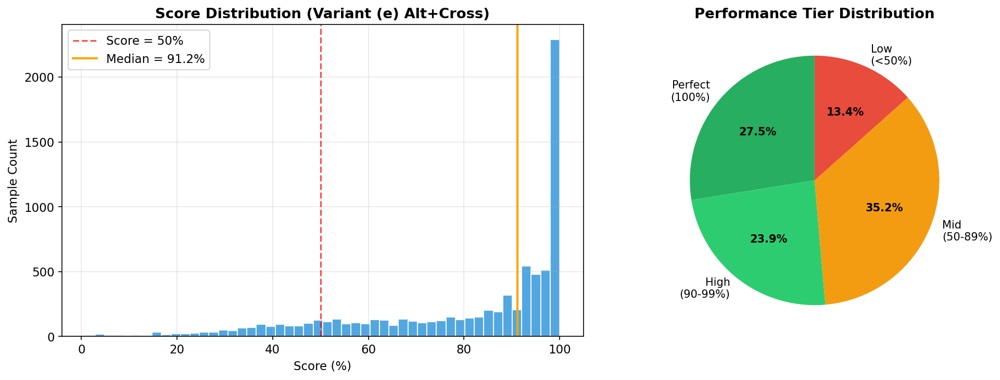

**시퀀스 길이별 성능**:

| 길이 구간 | 샘플 수 | 평균 Score | 중앙값 | Score < 50% 비율 |
|---|:---:|:---:|:---:|:---:|
| Short (≤8) | 3,986 | 91.9% | 97.1% | 2.1% |
| Medium (9-20) | 2,647 | 74.2% | 77.8% | 15.2% |
| Long (21-40) | 972 | 58.8% | 54.3% | 41.8% |
| Very Long (>40) | 276 | 50.1% | 43.7% | 60.5% |

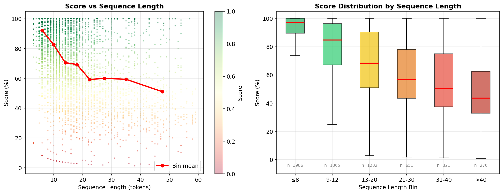

시퀀스 길이가 성능의 가장 강력한 예측 인자이며, 길이 20 을 넘어서면 실패 확률이 급격히 증가한다.

### 4.2 상위 성능 (Top Tier)

Score ≥ 0.99, (a)/(e) 모두 OCC 변환 및 BRep valid 통과.

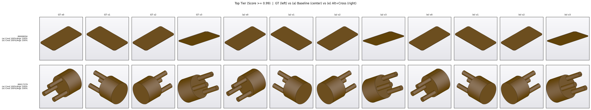

*왼쪽 4컬럼: GT, 중앙 4컬럼: (a) Baseline, 오른쪽 4컬럼: (e) Alt+Cross. 4 view = 등각 NE-top, NW-top, SW-top, lower-front.*

**Sample `00008056`** — 단순 평판 (seq_len=11, Line/Arc + 1 Extrude)
- (a)/(e) 모두 Cmd 100% / Args 100%. 4 뷰 전체에서 GT 와 pred 를 시각적으로 구분 불가.
- 전체 27.5%(2,168 샘플) 가 이러한 완벽 복원에 해당.

**Sample `00017379`** — 원통형 허브 + 방사형 돌기 (seq_len=20, Line·Arc·Circle + 2 Extrude)
- (a)/(e) 모두 Cmd 100% / Args 100%. 원통 몸체, 상면 원판, 3개 방사형 돌기 모두 일치.
- 길이 20 의 중간 복잡도에서도 두 variant 모두 완벽 복원 — sequence length 자체보다 command multiset 난이도가 성능을 좌우.

### 4.3 중위 성능 (Mid Tier)

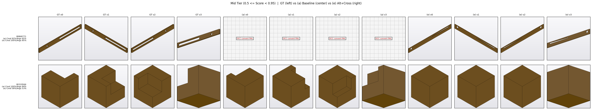

**Sample `00868771`** — 장변 레일 + 장공(slot) + 원형홀 (seq_len=14)

| | Cmd | Args | OCC 변환 | BRep Valid |
|--|:---:|:---:|:---:|:---:|
| (a) Baseline | 92.3% | 64.7% | **실패 (IndexError)** | — |
| (e) Alt+Cross | 100.0% | 85.3% | 성공 | 유효 |

- (a) 는 Cmd 92% 로 나쁘지 않지만 단 한 개 cmd 오류 (CIRCLE→ARC) 가 sketch loop 구조를 깨뜨려 IndexError 로 변환 실패. 3D 수준에서 "결과물 없음".
- (e) 는 모든 cmd 정확 예측 + 정상 3D 복원. 레일 길이·슬롯 위치·원형 홀 모두 GT 와 일치.
- **교훈**: Cmd 8%p 차이가 "3D 있음/없음" 이진 격차로 증폭되는 대표 케이스. Cross-attention decoder 의 cmd 수준 교정 효과 (+0.56 Cmd Acc) 가 downstream 3D validity 에 비선형적으로 기여.

**Sample `00319566`** — L자 블록 (2단 돌출, seq_len=13)

| | Cmd | Args | OCC 변환 | BRep Valid |
|--|:---:|:---:|:---:|:---:|
| (a) Baseline | 100.0% | 84.2% | 성공 | 유효 |
| (e) Alt+Cross | 58.3% | 52.6% | 성공 | 유효 |

- GT 는 두 직방체가 직각으로 맞물린 L자 블록 (2 extrudes 필요).
- (a) 는 cmd 100%, args 경미 오차 → L자 형태 유지, 한쪽 노치가 약간 얕음.
- (e) 는 2번째 sketch 구간에서 cmd 연쇄 오류 (SOL→LINE) → 두 번째 extrude 소실 → **단순 정육면체로 의미 붕괴**.
- **교훈**: "OCC 변환 성공" 만으로 품질을 판단하면 안 된다. Args 52% vs 84% 차이가 3D 에서는 "L → cube" semantic 붕괴. (e) 가 (a) 보다 열등한 드문 회귀 케이스로, (e) 의 val_loss_cmd=1.285 (vs (a) 1.178) 가 반영하는 과적합 현상과 일치.

### 4.4 하위 성능 (Bottom Tier)

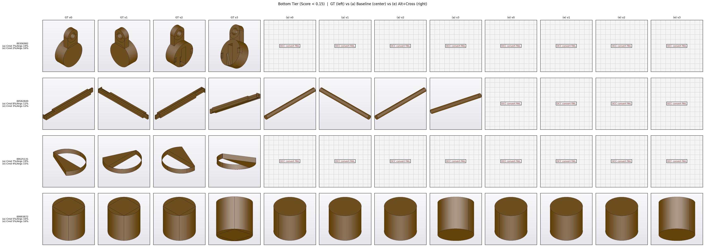

**Cross-variant 복원 비교**:

| Sample (seq_len) | (a) Cmd/Args | (a) OCC | (e) Cmd/Args | (e) OCC | GT OCC |
|---|:---:|:---:|:---:|:---:|:---:|
| 00306982 (56) | 7/19 | **실패 (AssertionError)** | 2/16 | **실패 (RuntimeError)** | 성공 |
| 00582849 (39) | 8/12 | 성공 | 3/12 | **실패 (RuntimeError)** | 성공 |
| 00625131 (28) | 7/19 | **실패 (AssertionError)** | 4/15 | **실패 (AssertionError)** | 성공 |
| 00883872 (23) | 5/16 | 성공 | 5/16 | 성공 | 성공 |

**Sample `00306982` (seq_len=56)** — Cmd 2-7%, 양 variant 모두 OCC 변환 실패. 56 토큰에 10 EXT 포함. pred 는 첫 토큰 이후 cmd 가 붕괴하여 SOL/EXT 구조가 무너진다.

**Sample `00582849` (seq_len=39)** — (a) 는 변환 성공하지만 의미 없는 형상. GT 는 둥근 단면의 곡선 바, (a) 는 얇은 대각선 막대로 복원. (e) 는 RuntimeError 로 변환 실패. "변환 성공" 이 "정답 근접" 을 보장하지 않음을 보여준다.

**Sample `00625131` (seq_len=28)** — GT 의 얇은 곡면 링 (Arc 다수) 은 OCC 변환 시 Face 생성이 극도로 민감한 구조. pred sequence 가 sketch loop 을 닫지 못해 양 variant AssertionError.

**Sample `00883872` (seq_len=23)** — (a)/(e) 모두 Cmd 5%, Args 16% 로 완전 붕괴. 양 variant OCC 변환 성공하지만 **단순 원통으로 퇴화** — cmd 전반이 무작위 수준이어도 우연히 "CIRCLE + EXT" 한 세트가 일관되면 cylinder 가 생성됨.

**교훈**: 하위 구간은 아키텍처 개선 효과 없음. 길이 30+ 시퀀스에 대해서는 hierarchical decoding, length-scheduled curriculum, 또는 구조적 보조 loss 가 필요.

### 4.5 Variant × 시퀀스 길이 / Command Confusion

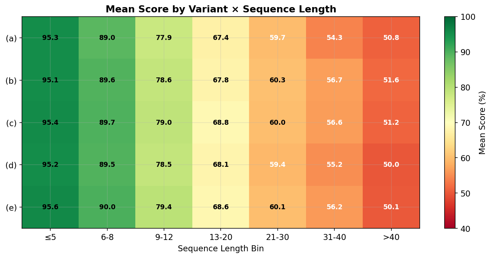

모든 variant 가 긴 시퀀스에서 공통 하락하며, variant 간 차이는 **중간 길이 (9-30) 구간에서 가장 두드러진다**. 3D 기준 OCC 변환 실패율이 급격히 커지는 영역과 일치 — variant 개선 효과가 집중되는 구간.

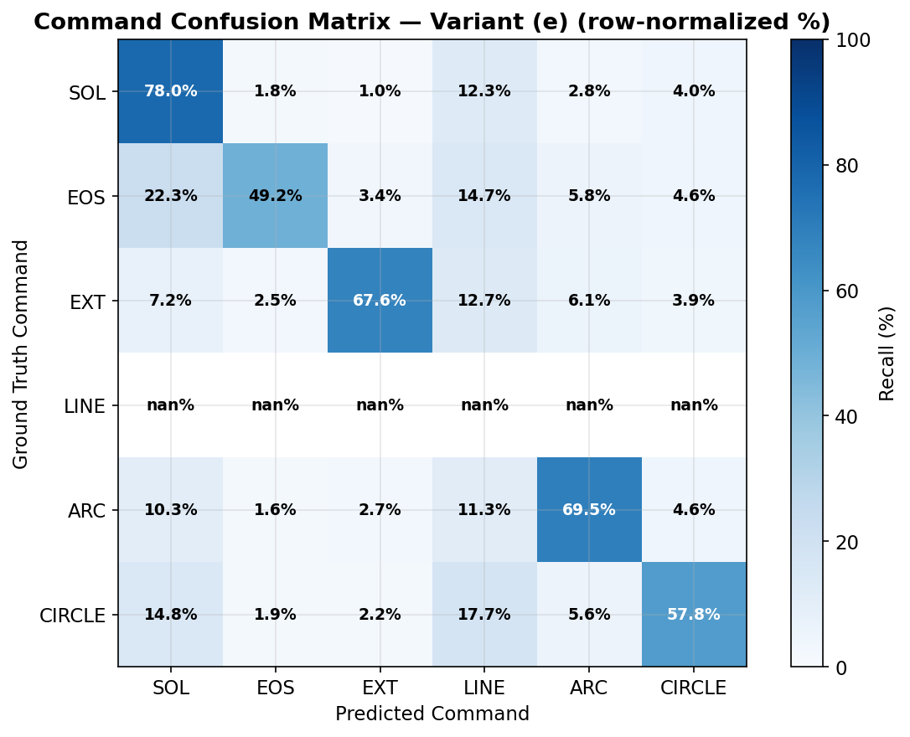

EXT (Extrude) 명령의 recall 이 가장 낮으며, EOS 나 sketch 명령으로 오예측되는 경향. 이는 §4.4 하위 샘플의 "EXT 소실 → 단순 원통/사각 퇴화" 패턴의 근본 원인이다.

### 4.6 정성 평가 요약

| 구간 | 특성 | 3D 복원 결과 | (e) 의 개선 여부 |
|---|---|---|:---:|
| **상위** (51.4%, score≥0.9) | seq≤20, 단순/혼합 형상 | GT 와 시각적 구분 불가 | — (둘 다 완벽) |
| **중위** (35.2%, 0.5≤score<0.9) | seq 10-30, 1-2 extrude | 대부분 성공, 일부 feature 누락 | 유의미 개선 (`00868771`). 회귀 케이스 존재 (`00319566`) |
| **하위** (13.4%, score<0.5) | seq 30+, 다중 extrude | cmd 붕괴 → 변환 실패 또는 원통 퇴화 | 개선 없음 (구조적 한계) |

---

## 5. 해석

### 5.1 두 방법론의 역할 분리

**Cross-Attention Decoder (방법론 2)**:
- (a)→(b): Cmd **+0.56**, Args +0.22. 디코더 정보 병목 해소가 **Command 정확도에 주로 기여**.
- (b)→(c): Bottleneck 추가 시 Cmd +0.36 추가. Element-wise bottleneck 이 per-token regularizer 역할.

**Alternating Attention Encoder (방법론 1)**:
- (a)→(d): Cmd +0.15, Args **+0.35**. 인코더 개선만으로는 Cmd 에 미미하나 **Args (특히 extrude) 에 유의미 기여** — plane +0.38, trans +0.35, extent +1.42.
- 계획서의 "Negative Control" 가설 (디코더 병목으로 Args 도 향상 불가) 을 일부 반박.

**조합 효과 (e)**:
- 개별 기여 합 (+0.57) 보다 큰 **Args +0.68** 달성 — 약한 시너지 존재.
- Extrude 계열 (plane, trans, extent) 에서 일관되게 최고 성능 + 최저 MAE.

### 5.2 3D 구조적 유효성 vs Token 정확도

| 지표 | Token accuracy 1위 | IR 1위 |
|---|:---:|:---:|
| Avg Args | (e) 79.33% | (d) 28.13% |
| Cmd Acc | (c) 82.89% | (d) 28.13% |

Token accuracy 우수 variant 와 BRep validity 우수 variant 가 일치하지 않는다. Args 개선이 반드시 구조적 유효성 향상으로 이어지지 않는다.

**Assertion/IndexError 분포 변화 (e vs a)**:
- AssertionError: 864 → 933 (+69)
- IndexError: 662 → 541 (-121)
- RuntimeError: 212 → 268 (+56)

Cross-attention 은 sketch 내부 구조를 잘 잡지만 (IndexError↓) SOL/EXT 전역 순서에는 동등하거나 fragile (AssertionError↑).

### 5.3 Mask-Predict 의 이중성

**긍정 (학습 regime)**:
- N=0 기준 (e) 대비 Avg Args +0.31%p, IR −1.4%p, CD trimmed −2.2% 일관 개선
- 해석: random masking 이 **data augmentation/regularization** 역할. MP 전용 파라미터 (+19.6K) 의 추가 학습이 encoder-decoder 표현력 강화.

**부정 (iterative refinement)**:
- N≥1 에서 Cmd Acc 82.61% → 48.42% 붕괴, IR 29.95% → 95%+ 폭증
- 원인:
  1. **Padding confidence 과다**: 1차 예측에서 EOS/padding 위치 confidence >0.99 → `topk(lowest-k)` 가 **유효 sketch 위치를 반복 mask**
  2. **학습-추론 불일치**: 학습 시 GT prev_pred, 추론 시 노이즈 포함 1차 예측 → `PartialPredictionEmbedding` 이 노이즈에 robust 하지 않음
  3. **Mask schedule 부적합**: 매 step 50%+ masking 이 NAT decoder convergence 저해

**부분적 긍정 (N=1 선택적 개선)**:
- plane +2.33, trans +9.39, extent +11.02 — 가장 약했던 extrude args 가 단 1회 refinement 로 대폭 개선
- Cmd 붕괴만 해결하면 hybrid inference (cmd=N=0, ext args=N=1) 로 활용 가능성

### 5.4 과적합 경향

| Variant | Train Loss (cmd) | Val Loss (cmd) | Gap |
|---|:---:|:---:|:---:|
| (a) | 0.329 | 1.178 | 0.849 |
| (b) | 0.247 | 1.166 | 0.919 |
| (c) | 0.251 | 1.297 | 1.046 |
| (d) | 0.258 | 1.397 | 1.139 |
| (e) | 0.267 | 1.285 | 1.018 |

- 모든 variant 에서 Baseline 대비 gap 증가 — 과적합 경향.
- (d) 의 val loss 가 최고 → Alternating encoder 의 표현력이 broadcast decoder 의 병목과 결합되어 encoder 쪽 과적합.
- (e) 는 (d) 대비 val loss 낮음 — cross-attention decoder 가 encoder 표현력을 효과적으로 활용하며 완화.

### 5.5 추론 비용 Trade-off

| Variant | Args 개선 (vs a) | Latency 증가 | 효율 (개선/latency비) |
|---|:---:|:---:|:---:|
| (b) | +0.22 | +22.0% | 0.010 |
| (c) | +0.24 | +23.5% | 0.010 |
| (d) | +0.35 | +53.7% | 0.007 |
| (e) | +0.68 | +75.7% | 0.009 |

Phase 3 의 torch.compile + FP16 이 (e) 의 latency 증가를 완전 상쇄 → **성능·속도 동시 우위**.

---

## 6. 결론

### 6.1 핵심 성과 (최종)

| 측면 | Baseline (a) FP32 | 최적 (e) + compile + FP16 | MP N=0 |
|---|:---:|:---:|:---:|
| Cmd Acc | 81.97% | 82.78% | 82.61% |
| Avg Args | 78.65% | 79.33% | **79.64%** |
| IR (전체 7881) | 29.58% | 29.47% | 29.95% (2000 subset) |
| IR (2000 subset) | 31.45% | 31.35% | **29.95%** |
| CD Trimmed | 0.0575 | 0.0537 | **0.0525** |
| Latency (batch=1) | 3.95 ms | **1.25 ms (3.14× ↑)** | 6.95 ms |
| Parameters | 7.68 M | 10.50 M | 10.52 M |

**주요 발견**:

1. **Variant (e) Alt+Cross 가 Phase 2 최적 모델**. 논문 원본 대비 Args +0.10%p, Cmd +0.02%p.
2. **Cross-Attention + Alternating Attention 의 기여 영역이 다름**. Cross-Attn → Cmd 주기여, Alt-Attn → Args (특히 extrude) 주기여. 조합 시 약한 시너지.
3. **torch.compile + FP16 으로 추론 비용 문제 완전 해결**. (e) 가 (a) 대비 3.14× 빠름.
4. **Mask-Predict 는 학습 regime 효과만 유효**. Iterative refinement 자체는 Cmd 붕괴 + IR 폭증으로 실용 불가.
5. **3D 구조 유효성은 아키텍처 개선에 둔감** (29-31% IR 수렴). Pred 22% 는 OCC 변환 실패 — Token accuracy 가 가리는 숨은 병목.

### 6.2 향후 과제

1. **과적합 완화**: (e) 기반으로 dropout 0.1→0.2, DropPath, stroke permutation/reversal augmentation 재학습
2. **Mask-Predict 개선**:
   - Padding 위치 masking 제외 gating (EOS 이후 확률적 masking 금지)
   - 학습 시 noisy prev_pred 사용 (학습-추론 gap 해소)
   - Cmd-frozen refinement (cmd=N=0 고정, args 만 refinement)
3. **Phase 4.2 — ArgsFCN 경량화**: sketch/extrusion 분리 + low-rank factorization (Linear(288, 4112) → Linear(288, 64) + Linear(64, 4112)), loss masking 필수
4. **하위 성능 구간 (seq 30+)**:
   - Hierarchical decoding
   - Length-scheduled curriculum
   - OCC-in-loop 구조적 보조 loss (AssertionError 직접 패널티)
5. **head_dim 최적화**: 현재 d_model=144, head_dim=18. head_dim=16 (d_model=128) 또는 20 (160) 으로 FlashAttention-2 경로 활성화

### 6.3 배포 권장

- **실시간 온라인 모드**: (e) + torch.compile(reduce-overhead) + FP16, batch=1 전용 CUDA Graph
- **오프라인 고품질 모드**: MP N=0 (iterative refinement 비활성), CD/IR 기준 최고 품질
- **Mask-Predict N≥1**: 현재 구현에서는 프로덕션 사용 비추. 연구용 유지.
- **3D 복원 후처리**: `cadlib_deepcad/` + `tools/render_cad.py` + `xvfb-run` 파이프라인 통합. BRepCheck_Analyzer 로 pre-validation, 실패 시 graceful fallback.

---

## 부록

### A. 실험 재현 가이드

**Phase 2 학습 (4x 병렬)**:
```bash
bash run_4x_parallel.sh
# 5 variants 동시 실행, 각 200 epochs, batch=256, lr=1e-3, input_option=4x
# 로그: train_logs/variant_{a,b,c,d,e}_4x.log
# 체크포인트: proj_log/variant_{a..e}_*_4x/model/latest.pth
```

**Phase 2 테스트**:
```bash
bash test.sh  # 각 variant 에 대해 python test.py --exp_name variant_X ...
# 결과: proj_log/variant_X/test_results/<sample_id>_vec.h5
```

**Phase 3 벤치마크**:
```bash
# torch.compile + FP16 은 inference 스크립트 내 torch.compile(mode="reduce-overhead") 래핑
# Accuracy 보존 검증: tools/ 내 diff 비교 스크립트
```

**Phase 4.1 Mask-Predict 학습**:
```bash
bash run_mask_predict_train.sh
# variant_e pretrained 로드 → 70 epochs fine-tune, lr=5e-4
# 체크포인트: proj_log/variant_e_mask_predict/model/latest.pth
```

**Phase 4.1 MP 테스트 N=0..3**:
```bash
bash run_mask_predict_test.sh
# N 별로 test.py --n_refinement_steps N --mask_ratios ... 실행
# 결과: proj_log/variant_e_mask_predict/test_results_n{0,1,2,3}/
```

**3D 평가 파이프라인**:
```bash
# Accuracy 집계
python tools/eval_mp.py  # → docs/phase4_accuracy.json

# CD/IR 평가 (2000 subset)
python tools/eval_cd_ir.py  # → docs/phase4_cd_ir.json

# Latency 벤치
python tools/bench_mp_latency.py  # → docs/phase4_latency.json

# 정성 렌더 + success-count
xvfb-run -a python tools/qualitative_eval.py --variant variant_e_alt_cross_4x \
  --sample-ids 00008056 00017379 00868771 00319566 ...
# → docs/figures/qualitative_3d/{render,success}_variant_*.json + PNG

# Tier grid 조합
python tools/make_tier_grids.py
# → docs/figures/qualitative_3d/grid_{top,mid,bottom}_tier.png
```

**환경 설정**:
```bash
# PyTorch 2.7.0 + CUDA 12.8
pip install torch==2.7.0 torchvision torchaudio
pip install pythonocc-core==7.5.1 trimesh scipy joblib
sudo apt-get install xvfb libgl1-mesa-glx

# DeepCAD 패치 (cadlib_deepcad/)
# - np.int → int (NumPy 1.24+)
# - matplotlib.use('Agg') (headless)
```

### B. 파일 및 경로 색인

**학습 체크포인트** (`/home/work/Drawing2CAD/proj_log/`):
- `variant_a_baseline_4x/model/latest.pth` (88.0 MB)
- `variant_b_cross_attn_4x/model/latest.pth` (97.1 MB)
- `variant_c_cross_attn_bn_4x/model/latest.pth` (97.9 MB)
- `variant_d_alt_attn_4x/model/latest.pth` (111.3 MB)
- `variant_e_alt_cross_4x/model/latest.pth` (120.4 MB)
- `variant_e_mask_predict/model/latest.pth` (120.6 MB)

**테스트 결과** (각 `_vec.h5`, 7,881 파일/variant):
- `proj_log/variant_*_4x/test_results/`
- `proj_log/variant_e_mask_predict/test_results_n{0,1,2,3}/`

**평가 JSON** (`/home/work/Drawing2CAD/docs/`):
- `phase4_accuracy.json` — MP N=0..3 cmd/args accuracy
- `phase4_latency.json` — MP N별 latency
- `phase4_cd_ir.json` — 9 configs CD/IR (2000 subset)
- `_cd_smoke.json` — 50 샘플 smoke test

**정성 평가 산출물** (`/home/work/Drawing2CAD/docs/figures/qualitative_3d/`):
- `success_variant_{a,b,c,d,e}_*_4x.json` — 전체 7881 IR 집계
- `render_variant_{a,e}_*_4x.json` — 8 샘플 렌더 메타
- `qualitative_eval_summary.json` — 통합 집계
- `grid_{top,mid,bottom}_tier.png` — Tier 비교 그리드
- `variant_{a,e}_*_4x/` — 개별 PNG (각 76개, 11 샘플 × gt/pred × 4 views)

**Phase 2 정량 시각화** (`/home/work/Drawing2CAD/docs/figures/fig*.png`):
- fig1: Cmd/Args accuracy bar
- fig2: Per-type accuracy
- fig3: MAE comparison
- fig4: Accuracy vs Latency scatter
- fig5: Delta accuracy
- fig6: Score distribution
- fig7: Score vs SeqLen
- fig8: Qualitative samples
- fig9: Variant × SeqLen heatmap
- fig10: Cmd confusion matrix

**코드**:
- 모델 정의: `model/model.py`, `model/layers/improved_transformer.py`, `model/layers/transformer.py`
- 학습/평가: `trainer/trainer.py`, `trainer/loss.py`, `train.py`, `test.py`
- 평가 도구: `tools/eval_mp.py`, `tools/eval_cd_ir.py`, `tools/bench_mp_latency.py`, `tools/render_cad.py`, `tools/qualitative_eval.py`, `tools/make_tier_grids.py`
- DeepCAD 통합: `cadlib_deepcad/{curves,extrude,sketch,visualize,macro,math_utils}.py`
- 설정: `config/config.py` (Phase 4 MP 인자 4개 추가: `use_mask_predict`, `n_refinement_steps`, `mask_ratios`, `freeze_pretrained`)

**보고서**:
- `docs/report_phase2_ablation.md` — Phase 2/3/4 상세 원본 (유지)
- `docs/experiment_artifacts.md` — 전체 산출물 매니페스트
- `docs/final_report.md` — 이 문서 (최종 종합)
- `improvement_plan.md` — 개선 계획서

### C. 에러 / 이슈 해결 기록

1. **WandB API 키 이슈 (2026-04-14 00:44)**: 초기 학습 시도 시 `wandb.errors.UsageError: No API key configured`. `~/.netrc` 에 credential 저장 (`api.wandb.ai`, entity=`jujoo`) 으로 해결.

2. **variant_e (3x) 로그 truncation**: `variant_e.log` 가 2.6 MB (다른 3x 로그 ~36 MB 대비 작음). `EPOCH[15]` 까지 기록되고 중단되었으나 `progress.log` 에서 학습 완료 (`[DONE] Variant (e) Alt+Cross`) 확인. epoch100/200 체크포인트 없이 latest 만 존재 → 4x 재학습으로 대체.

3. **NumPy 1.24+ `np.int` deprecation**: DeepCAD 원본 `cadlib/curves.py`, `extrude.py` 의 `np.int` 호출 → `int` 로 일괄 패치 (`cadlib_deepcad/`). 총 13개 호출 치환.

4. **matplotlib TkAgg 백엔드 오류 (xvfb headless)**: `cadlib_deepcad/sketch.py` 의 `matplotlib.use('TkAgg')` → `'Agg'` 로 변경. xvfb-run + Viewer3d offscreen 렌더 호환.

5. **OCC Null Triangulation 경고**: `eval_cd_ir.py` 실행 시 "N faces have been skipped due to null triangulation" 다수 발생. IR 계산에는 영향 없음 (pred:convert 에러 taxonomy 로 잡힘). cd_mean 에 소폭 영향 가능.

6. **Mask-Predict iterative refinement IndexError 폭증**: N=1 에서 1831/2000 샘플 실패. 원인은 §5.3 분석 참조 — padding confidence 과다 + 학습-추론 gap. 해결 방안은 §6.2 권장.

7. **CUDA Graph CPU-GPU sync 점검**: Phase 3 진행 시 `TORCH_LOGS=graph_breaks` 로 forward path 내 `.item()`, `.nonzero()`, `.cpu()` 호출 부재 확인. `trainer.py:80,107` 의 `.cpu().numpy()` 는 평가/후처리 경로 (forward 외부) 로 compile 영향 없음.

8. **MP smoke test 디렉토리 (`_test_mp1-7`)**: 개발 중 생성된 7개 빈 디렉토리. `nr_epochs=1`, `freeze_pretrained=true` 설정으로 시작했으나 checkpoint 저장 전 중단. 정식 학습 (`variant_e_mask_predict`) 은 `nr_epochs=70`, `freeze_pretrained=false` 로 전체 파라미터 fine-tuning.

### D. Variant 및 MP 설정 요약

**Phase 2 공통 (모든 4x variants)**:
- nr_epochs: 200, batch_size: 256, lr: 1e-3, input_option: 4x, num_workers: 2
- Optimizer: Adam, Scheduler: LambdaLR (cosine-like)
- 학습 시작 조건: scratch (Phase 1 nn.MHA 전환 후)

**Phase 4.1 Mask-Predict 설정**:
- Pretrained: `variant_e_alt_cross_4x/model/latest.pth`
- nr_epochs: 70, batch_size: 256, lr: 5e-4, input_option: 4x
- use_mask_predict: true, freeze_pretrained: false
- Training mask_ratio: Uniform(0.15, 0.85) per step
- Inference mask schedules:
  - N=0: 없음 (refinement 비활성)
  - N=1: [0.5]
  - N=2: [0.5, 0.3]
  - N=3: [0.6, 0.4, 0.2]

**Git HEAD**: `51f8daf` (feat: add Phase 4 Mask-Predict refinement + OCC-based 3D qualitative/CD/IR evaluation, 182 files, +3009/-129 lines)

---

*본 보고서는 2026-04-18 기준 모든 실험 결과를 통합하여 외부 공유 가능한 형태로 작성되었다. 상세 Phase 2 ablation 분석은 `report_phase2_ablation.md` 참조.*
