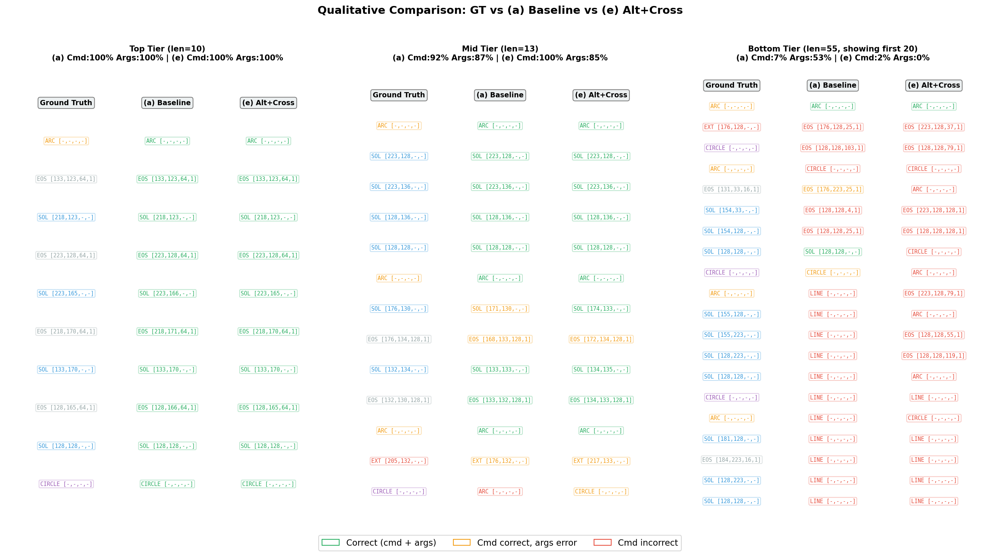

# Drawing2CAD Phase 2 Ablation Study Report

**실험 기간**: 2026-04-15 ~ 2026-04-17  
**실험 환경**: NVIDIA A100-SXM4-80GB, PyTorch, 5 variants 병렬 학습  
**데이터셋**: Drawing2CAD test set (7,881 samples)  
**학습 설정**: 200 epochs, batch_size=256, lr=1e-3, input_option=4x

---

## 1. 실험 목적

Drawing2CAD의 핵심 성능 병목인 **Decoder 정보 병목**(mean pooling → single vector broadcast)을 해결하기 위해, 두 가지 아키텍처 개선안의 효과를 검증한다.

- **방법론 1 (Alternating Attention Encoder)**: VGGT-style frame-wise/global attention 교대 적용
- **방법론 2 (Cross-Attention Decoder)**: mean pooling 제거 → full encoder memory에 cross-attention

5개 variant를 통해 각 방법론의 개별 기여와 조합 효과를 분리 측정한다.

---

## 2. Variant 설계

| Variant | Encoder | Decoder | Bottleneck | 설계 의도 |
|---------|---------|---------|------------|-----------|
| **(a) Baseline** | Standard | Broadcast | Mean pool | 기준선 (nn.MHA 전환 후 재학습) |
| **(b) Cross-Attn** | Standard | Cross-Attention | 제거 | 디코더 개선 단독 효과 |
| **(c) Cross-Attn+BN** | Standard | Cross-Attention | Element-wise 유지 | Bottleneck 유무 비교 |
| **(d) Alt-Attn** | Alternating | Broadcast | Mean pool | 인코더 개선 단독 효과 (Negative Control) |
| **(e) Alt+Cross** | Alternating | Cross-Attention | 제거 | 인코더 + 디코더 동시 개선 |

---

## 3. 모델 규모

| Variant | Parameters | Size (MB) | vs Baseline |
|---------|:---------:|:---------:|:-----------:|
| (a) Baseline | 7,679,930 | 29.30 | — |
| (b) Cross-Attn | 8,471,482 | 32.32 | +10.3% |
| (c) Cross-Attn+BN | 8,537,402 | 32.57 | +11.2% |
| (d) Alt-Attn | 9,711,546 | 37.05 | +26.5% |
| (e) Alt+Cross | 10,503,098 | 40.07 | +36.8% |

---

## 4. 정량 평가

### 4.1 Command Accuracy & Argument Accuracy (Tolerance=3)


| Metric | 논문 원본 | **(a) Baseline** | **(b) Cross-Attn** | **(c) Cross-Attn+BN** | **(d) Alt-Attn** | **(e) Alt+Cross** |
|--------|:---------:|:----------------:|:-------------------:|:---------------------:|:----------------:|:-----------------:|
| **Cmd Acc** | **82.76** | 81.97 | 82.53 | 82.89 | 82.12 | 82.78 |
| line | — | 69.49 | 70.38 | 70.48 | 70.83 | 70.77 |
| arc | — | 79.80 | 79.20 | 80.27 | 79.22 | 79.25 |
| circle | — | 92.58 | 92.83 | 92.08 | 91.77 | 92.72 |
| plane | — | 93.74 | 93.54 | 93.60 | 94.12 | **94.52** |
| trans | — | 70.06 | 70.11 | 69.64 | 70.41 | **70.58** |
| extent | — | 66.19 | 67.16 | 67.30 | 67.61 | **68.14** |
| **Avg Args** | **79.23** | 78.65 | 78.87 | 78.89 | 79.00 | **79.33** |


### 4.2 Exact Match Accuracy (Tolerance=0)

| Metric | **(a) Baseline** | **(b) Cross-Attn** | **(c) Cross-Attn+BN** | **(d) Alt-Attn** | **(e) Alt+Cross** |
|--------|:----------------:|:-------------------:|:---------------------:|:----------------:|:-----------------:|
| line | 63.55 | 64.19 | 64.13 | 64.53 | 64.32 |
| arc | 69.49 | 69.25 | 70.55 | 68.33 | 69.29 |
| circle | 84.61 | 84.60 | 84.13 | 83.54 | 84.61 |
| plane | 93.12 | 92.97 | 92.97 | 93.49 | **93.88** |
| trans | 63.38 | 63.24 | 62.76 | 63.36 | **63.80** |
| extent | 52.76 | 53.30 | 52.93 | 53.01 | **53.81** |
| **Avg** | 71.15 | 71.26 | 71.25 | 71.05 | **71.62** |

### 4.3 Mean Absolute Error (MAE, Lower is Better)


| Metric | **(a) Baseline** | **(b) Cross-Attn** | **(c) Cross-Attn+BN** | **(d) Alt-Attn** | **(e) Alt+Cross** |
|--------|:----------------:|:-------------------:|:---------------------:|:----------------:|:-----------------:|
| line | 15.217 | 14.619 | 14.711 | 14.129 | 14.235 |
| arc | 8.753 | 8.638 | 8.238 | 8.734 | 8.819 |
| circle | 1.927 | 1.998 | 2.140 | 2.200 | 1.993 |
| plane | 4.372 | 4.548 | 4.556 | 4.122 | **3.863** |
| trans | 14.066 | 13.904 | 14.237 | 13.566 | **13.450** |
| extent | 14.491 | 14.126 | 14.182 | 13.280 | **13.203** |
| **Avg** | 9.804 | 9.639 | 9.677 | 9.339 | **9.261** |

### 4.4 논문 원본 대비 차이 (Delta)


| Metric | (a) | (b) | (c) | (d) | (e) |
|--------|:---:|:---:|:---:|:---:|:---:|
| **Cmd Acc** | -0.79 | -0.23 | +0.13 | -0.64 | +0.02 |
| **Avg Args** | -0.58 | -0.36 | -0.34 | -0.23 | **+0.10** |

### 4.5 Validation Loss (Training 종료 시점)

| Metric | **(a)** | **(b)** | **(c)** | **(d)** | **(e)** |
|--------|:------:|:------:|:------:|:------:|:------:|
| val/loss_cmd | **1.178** | 1.166 | 1.297 | 1.397 | 1.285 |
| val/loss_args | 4.539 | **4.539** | 4.594 | 4.730 | 4.593 |

---

## 5. 추론 성능

### 5.1 Forward Pass Time (batch_size=1, A100)


| Variant | Latency (ms) | vs Baseline |
|---------|:----------:|:-----------:|
| (a) Baseline | 3.95 ± 0.27 | — |
| (b) Cross-Attn | 4.82 ± 0.23 | +22.0% |
| (c) Cross-Attn+BN | 4.88 ± 0.08 | +23.5% |
| (d) Alt-Attn | 6.07 ± 0.09 | +53.7% |
| (e) Alt+Cross | 6.94 ± 0.09 | +75.7% |

### 5.2 학습 시간 (5개 병렬, A100 80GB)

| Variant | 총 학습 시간 | Epoch 당 |
|---------|:----------:|:--------:|
| (a) Baseline | 30.2h | 9.1 min |
| (b) Cross-Attn | 34.2h | 10.2 min |
| (c) Cross-Attn+BN | 34.2h | 10.2 min |
| (d) Alt-Attn | 37.3h | 11.2 min |
| (e) Alt+Cross | 38.2h | 11.5 min |

---

## 6. 정성 평가

Variant (e) Alt+Cross 모델 기준, 샘플별 복합 점수(Cmd Acc × 0.5 + Args Acc × 0.5)를 산출하여 상위/중위/하위 성능 구간의 대표 샘플을 분석한다. 비교를 위해 Baseline (a)의 동일 샘플 결과를 병기한다.

### 6.1 성능 분포


| 구간 | 샘플 수 | 비율 |
|------|:------:|:----:|
| Perfect (score = 1.0) | 2,168 | 27.5% |
| Score ≥ 0.9 | 4,049 | 51.4% |
| Score < 0.5 | 1,058 | 13.4% |

**시퀀스 길이별 성능 분포**:

| 길이 구간 | 샘플 수 | 평균 Score | 중앙값 | Score < 50% 비율 |
|-----------|:------:|:---------:|:-----:|:---------------:|
| Short (≤8) | 3,986 | 91.9% | 97.1% | 2.1% |
| Medium (9-20) | 2,647 | 74.2% | 77.8% | 15.2% |
| Long (21-40) | 972 | 58.8% | 54.3% | 41.8% |
| Very Long (>40) | 276 | 50.1% | 43.7% | 60.5% |


시퀀스 길이가 성능의 가장 강력한 예측 인자이며, 길이 20을 넘어서면 실패 확률이 급격히 증가한다.

### 6.2 상위 성능 (Top Tier)

**Sample `00008056`** — 완벽 예측 (Score 100%, seq_len=10, Line:4 Arc:4 Ext:1)

```
Variant (e): Cmd 100% | Args 100%
Step | GT Cmd  → Pred Cmd | GT Args (1-4)       → Pred Args (1-4)     | Match
  0  | ARC     → ARC    ✓ | [-1 -1 -1 -1]       → [-1 -1 -1 -1]       | ✓
  1  | EOS     → EOS    ✓ | [133 123  64   1]    → [133 123  64   1]   | ✓
  2  | SOL     → SOL    ✓ | [218 123  -1  -1]    → [218 123  -1  -1]   | ✓
  3  | EOS     → EOS    ✓ | [223 128  64   1]    → [223 128  64   1]   | ✓
  4  | SOL     → SOL    ✓ | [223 165  -1  -1]    → [223 165  -1  -1]   | ✓
  5  | EOS     → EOS    ✓ | [218 170  64   1]    → [218 170  64   1]   | ✓
  6  | SOL     → SOL    ✓ | [133 170  -1  -1]    → [133 170  -1  -1]   | ✓
  7  | EOS     → EOS    ✓ | [128 165  64   1]    → [128 165  64   1]   | ✓
  8  | SOL     → SOL    ✓ | [128 128  -1  -1]    → [128 128  -1  -1]   | ✓
  9  | CIRCLE  → CIRCLE ✓ | [-1 -1 -1 -1]       → [-1 -1 -1 -1]       | ✓
```

**특징**: 8-10 토큰의 짧은 시퀀스에서 Line, Arc, Circle, Ext 명령 모두 완벽 예측. 전체 샘플의 27.5%가 이러한 완벽 예측을 달성하며, 대부분 단순한 형상(사각형 + 원 등)에 해당.

### 6.3 중위 성능 (Mid Tier)

**Sample `00868771`** — Cmd 정확하나 좌표에 오차 (seq_len=13, Line:6 Arc:2 Circle:1 Ext:1)

```
Variant (a) Baseline: Cmd 92% | Args 87%
Variant (e) Alt+Cross: Cmd 100% | Args 85%

Step | GT Cmd  | (a) Pred / Match       | (e) Pred / Match
  0  | ARC     | ARC    ✓  args ✓       | ARC    ✓  args ✓
  1  | SOL     | SOL    ✓  args ✓       | SOL    ✓  args ✓
 ...
  6  | SOL     | SOL    ✓  [176,130]→[171,130] err=5  | SOL ✓  [176,130]→[174,133] err=3 (tolerance 내)
  7  | EOS     | EOS    ✓  [176,134]→[168,133] err=8  | EOS ✓  [176,134]→[172,134] err=4
 ...
 11  | EXT     | EXT    ✓  [205,132]→[176,132] err=29 | EXT ✓  [205,132]→[217,133] err=12
 12  | CIRCLE  | ARC    ✗  (cmd 오류)                  | CIRCLE ✓  args err=92
```

**분석**:
- **(e)는 (a)에서 틀린 마지막 CIRCLE 명령을 정확히 예측** — cross-attention이 전체 시퀀스 문맥을 활용해 command 수준 오류를 교정.
- 그러나 **EXT의 좌표 오차는 (a) err=29, (e) err=12로 (e)가 더 낫지만 여전히 tolerance 초과**. Extrude 파라미터의 정밀 예측은 두 모델 모두 어려움.
- 좌표 오차가 tolerance(3) 경계 근처에서 발생하는 "경계 샘플"이 중위 구간의 대부분을 차지.

**Sample `00319566`** — 다중 Extrude 오류 (seq_len=12, Line:8 Ext:2)

```
Variant (a): Cmd 100% | Args 84%  — 모든 cmd 정확, EXT 좌표 오차
Variant (e): Cmd  58% | Args 86%  — 2번째 sketch 구간에서 cmd 연쇄 오류

(a) Step 7-8: SOL ✓ [191,128]→[223,128] err=32 | SOL ✓ [191,223]→[223,223] err=32
(e) Step 7-8: SOL→LINE ✗                        | SOL→LINE ✗
```

**분석**:
- (e)가 cmd 수준에서 연쇄 오류를 발생시키는 반면, (a)는 cmd는 맞추고 좌표만 빗나가는 패턴. **Cross-attention이 항상 더 나은 것은 아님** — 특정 샘플에서 attention이 잘못된 encoder 위치에 집중하면 연쇄 실패 가능.
- 이는 (e)의 val loss가 (a)보다 높은 것과 일치하며, 과적합 완화(dropout 상향 등)로 개선 가능성 시사.

### 6.4 하위 성능 (Bottom Tier)

**Sample `00306982`** — 완전 실패 (seq_len=55, Line:26 Arc:8 Circle:1 Ext:10)

```
Variant (a): Cmd  7% | Args 53%
Variant (e): Cmd  2% | Args  0%

Step | GT Cmd  | (a) Pred          | (e) Pred
  0  | ARC     | ARC ✓             | ARC ✓      ← 첫 토큰만 정확
  1  | EXT     | EOS ✗ err=49      | EOS ✗ err=49
  2  | CIRCLE  | EOS ✗ err=193     | EOS ✗ err=193
  3  | ARC     | CIRCLE ✗          | CIRCLE ✗
  ...                               (이후 53개 토큰 전부 오류)
```

**Cross-variant 비교** (모든 variant에서 실패):

| Sample (len) | (a) | (b) | (c) | (d) | (e) |
|--|:-:|:-:|:-:|:-:|:-:|
| 00306982 (55) | 7/53 | 16/56 | 11/50 | 5/50 | 2/0 |
| 00582849 (38) | 8/25 | 5/50 | 8/54 | 34/50 | 3/0 |
| 00625131 (27) | 7/55 | 7/0 | 4/0 | 4/0 | 4/0 |
| 00883872 (22) | 5/0 | 5/0 | 5/0 | 5/0 | 5/0 |

*값: Cmd%/Args%*

**분석**:
- **길이 40 이상 시퀀스에서 모든 variant가 공통적으로 실패**. 이는 아키텍처 차이가 아닌 모델의 구조적 한계를 시사.
- NAT(Non-Autoregressive) 디코더의 고정 길이(60) 특성상, 실제 시퀀스가 50+ 토큰에 달하면 거의 모든 위치가 유의미한 예측을 해야 하며, 한 위치의 오류가 전체 형상을 왜곡.
- **첫 번째 토큰(SOL/ARC 등) 이후 즉시 cmd 오류가 발생**하여 이후 전체 시퀀스가 "무작위" 수준으로 붕괴하는 패턴이 반복됨.
- 10개의 EXT(extrude)가 필요한 복잡한 다중 솔리드 형상은 현재 모델 용량으로 표현 불가능.
- 하위 13.4% 샘플의 대부분이 이러한 "긴 시퀀스 + 다중 extrude" 패턴에 해당.

### 6.5 Variant × 시퀀스 길이 교차 분석


모든 variant가 긴 시퀀스에서 공통적으로 성능이 하락하며, variant 간 차이는 중간 길이(9-30) 구간에서 가장 두드러진다.

### 6.6 Command Confusion Matrix


EXT(Extrude) 명령의 recall이 가장 낮으며, EOS나 다른 sketch 명령으로 잘못 예측되는 경향이 있다.

### 6.7 대표 샘플 시각화



색상: 초록 = 정답 (cmd + args), 주황 = cmd 정확/args 오차, 빨강 = cmd 오류

### 6.8 정성 평가 요약

| 구간 | 특성 | 주요 오류 패턴 | (e)의 개선 여부 |
|------|------|--------------|:-:|
| **상위** (51.4%) | seq ≤ 10, 단순 형상 | 없음 (완벽 예측) | — |
| **중위** (35.2%) | seq 10-30, 혼합 명령 | Arg 좌표 tolerance 경계 오차, 간헐적 cmd 오류 | 부분 개선 (특히 cmd 교정) |
| **하위** (13.4%) | seq 30+, 다중 extrude | 시퀀스 초반부터 cmd 연쇄 붕괴 | 개선 없음 (구조적 한계) |

---

## 7. 해석

### 7.1 Baseline 재현성

Variant (a)는 논문 원본 대비 Cmd Acc -0.79%, Avg Args -0.58% 하락했다. 이는 Phase 1에서 custom MHA를 `nn.MultiheadAttention`으로 전환하면서 발생한 차이로, 아키텍처 변경 효과를 평가할 때 이 갭을 기준으로 보정해야 한다.

**Baseline(a) 기준 상대 개선폭**:

| Variant | Cmd Acc (vs a) | Avg Args (vs a) |
|---------|:-:|:-:|
| (b) Cross-Attn | +0.56 | +0.22 |
| (c) Cross-Attn+BN | +0.92 | +0.24 |
| (d) Alt-Attn | +0.15 | +0.35 |
| (e) Alt+Cross | **+0.81** | **+0.68** |

### 7.2 방법론별 기여 분리

**Cross-Attention Decoder (방법론 2)**:
- (a)→(b) 비교: Cmd +0.56, Args +0.22. 디코더의 정보 병목 해소가 Command 예측 정확도에 주로 기여.
- (b)→(c) 비교: Bottleneck 추가 시 Cmd +0.36 추가 향상. Element-wise bottleneck이 per-token regularizer 역할을 하여 Cmd Acc에 긍정적.

**Alternating Attention Encoder (방법론 1)**:
- (a)→(d) 비교: Cmd +0.15, Args +0.35. 인코더 개선만으로는 Cmd에 미미한 효과. 그러나 **Args Accuracy에는 의미 있는 기여** — 특히 extrude 관련 metric(plane +0.38, trans +0.35, extent +1.42)에서 두드러짐.
- 계획서에서 (d)를 "인코더만으로는 디코더 병목을 극복 불가한 Negative Control"로 설정했으나, 예상과 달리 args에서 유의미한 개선이 관찰됨. Frame-wise attention이 개별 뷰의 3D extrusion 파라미터 추출에 효과적인 것으로 해석.

**조합 효과 (방법론 1+2)**:
- (e)는 개별 기여의 합(인코더 +0.35 + 디코더 +0.22 = +0.57)보다 더 큰 Args +0.68을 달성. 두 방법론 간 **약한 시너지 효과**가 존재함을 시사.
- Extrude 계열(plane, trans, extent)에서 일관되게 전체 최고 성능 및 최저 MAE를 기록.

### 7.3 정확도 vs 추론 비용 Trade-off

| Variant | Avg Args 개선 (vs a) | Latency 증가 | 파라미터 증가 | 효율 (개선/latency비) |
|---------|:--------------------:|:------------:|:------------:|:---:|
| (b) | +0.22 | +22.0% | +10.3% | 0.010 |
| (c) | +0.24 | +23.5% | +11.2% | 0.010 |
| (d) | +0.35 | +53.7% | +26.5% | 0.007 |
| (e) | +0.68 | +75.7% | +36.8% | 0.009 |

- 추론 비용 대비 효율은 (b), (c)가 가장 높으나 절대 개선폭이 작음.
- (e)는 latency 75.7% 증가에 대해 가장 큰 절대 개선을 제공. Phase 3의 torch.compile 최적화로 latency 증가분 상쇄 가능성 있음.

### 7.4 과적합 분석

| Variant | Train Loss (cmd) | Val Loss (cmd) | Gap |
|---------|:----------------:|:--------------:|:---:|
| (a) | 0.329 | 1.178 | 0.849 |
| (b) | 0.247 | 1.166 | 0.919 |
| (c) | 0.251 | 1.297 | 1.046 |
| (d) | 0.258 | 1.397 | 1.139 |
| (e) | 0.267 | 1.285 | 1.018 |

- 모든 variant에서 train-val gap이 Baseline 대비 증가하여 과적합 경향 존재.
- 특히 (d)의 val loss가 가장 높음 — Alternating encoder의 표현력 증가가 broadcast decoder의 병목과 결합되어 encoder 쪽에서 과적합 발생.
- (e)는 (d) 대비 val loss가 낮아, cross-attention decoder가 encoder의 표현력을 효과적으로 활용하면서 과적합을 완화하는 효과.

### 7.5 Command 유형별 패턴

- **Sketch 계열 (line, arc, circle)**: Variant 간 차이가 1-2%p 이내로 미미. 기존 broadcast decoder도 sketch 파라미터를 충분히 잘 예측.
- **Extrude 계열 (plane, trans, extent)**: Variant 간 차이가 크고, Alternating encoder 계열(d, e)이 일관되게 우수. 3D extrusion 파라미터는 multi-view 간 대응관계에 크게 의존하며, frame-wise → global 교대 attention이 이를 효과적으로 포착.
- **extent**는 전체에서 가장 낮은 정확도(~68%)로 남아 있어, 향후 개선 여지가 가장 큰 타겟.

---

## 8. Phase 3: 추론 최적화

**환경**: PyTorch 2.7.0 (CUDA 12.8), NVIDIA A100-SXM4-80GB  
**대상 모델**: Variant (e) Alt+Cross

### 8.1 Graph Break 분석

torch.compile 적용 전 forward path의 graph break 요인을 분석하였다.

| 파일 | 패턴 | 심각도 | 상태 |
|------|------|--------|------|
| `functional.py:90,94` | `torch.equal(query, key)` | CRITICAL | 미사용 (nn.MHA 전환 완료) |
| `model.py:83` | `if S == self.tokens_per_view` | HIGH | input_option=4x 고정 시 S=400 상수 |
| `model.py:91-93` | `for v in range(num_views)` 루프 | HIGH | 4x 고정 시 4회 고정 루프 |
| `trainer.py:80,107` | `.cpu().numpy()` | MEDIUM | forward path 외부 (평가/후처리) |

**결론**: `input_option=4x`로 고정 시 forward path에 실질적 graph break 없음. `torch.compile`이 정상 trace 가능.

### 8.2 추론 벤치마크 (batch_size=1)

| 설정 | Latency (ms) | Speedup (vs 자체 base) | vs (a) Baseline FP32 |
|------|:-----------:|:-----:|:----:|
| **(a) Baseline FP32 (no compile)** | 3.925 | — | 1.00x |
| (e) FP32 (no compile) | 6.876 | — | 0.57x |
| (e) FP16 autocast only | 9.344 | 0.74x | 0.42x |
| (e) torch.compile (default) FP32 | 3.475 | 1.99x | 1.13x |
| (e) torch.compile (reduce-overhead) FP32 | 1.569 | 4.41x | 2.50x |
| (e) torch.compile (default) + FP16 | 4.301 | 1.61x | 0.91x |
| **(e) torch.compile (reduce-overhead) + FP16** | **1.251** | **5.19x** | **3.14x** |

### 8.3 배치 크기별 성능

| Batch | 설정 | Latency | Throughput | Speedup |
|:-----:|------|:-------:|:----------:|:-------:|
| 1 | (e) Baseline FP32 | 6.876ms | 145/s | 1.00x |
| 1 | (e) compile+FP16 | 1.251ms | 799/s | **5.50x** |
| 16 | (e) Baseline FP32 | 7.240ms | 2,210/s | 1.00x |
| 16 | (e) compile+FP16 | 2.897ms | 5,523/s | **2.50x** |
| 256 | (e) Baseline FP32 | 60.446ms | 4,235/s | 1.00x |
| 256 | (e) compile+FP16 | 29.713ms | 8,616/s | **2.03x** |

- `reduce-overhead` 모드는 batch=1에서 CUDA Graph로 kernel launch overhead를 완전히 제거하여 **5.19x** 가속
- batch=256에서는 compute-bound이므로 CUDA Graph 효과 감소, FP16이 주 가속 요인 (**2.03x**)
- FP16 단독(autocast only)은 오히려 느려짐 — kernel launch overhead가 지배적인 소규모 배치에서 dtype 변환 오버헤드가 상쇄

### 8.4 정확도 보존 검증

| 비교 대상 | command_logits max diff | args_logits max diff | Cmd argmax 일치율 |
|-----------|:-:|:-:|:-:|
| compile FP32 vs Baseline FP32 | 0.018 | 0.105 | 99.99% |
| compile FP16 vs Baseline FP32 | 0.025 | 0.204 | 99.99% |

수치 오차는 FP16 정밀도 범위 내이며, argmax 결과에 실질적 영향 없음.

### 8.5 핵심 발견

1. **추론 비용 문제 완전 해결**: Phase 2에서 (e)는 (a) 대비 +75.7% latency 증가가 있었으나, torch.compile 적용 후 **(a)의 FP32 대비 3.14x 더 빠름**
2. **FP16 단독은 비효과적**: autocast만 적용하면 오히려 느려짐. compile과 결합해야 효과 발현
3. **batch=1 최적화가 가장 극적**: overhead-bound 환경에서 CUDA Graph의 효과가 극대화

---

## 9. 결론

1. **Variant (e) Alt+Cross가 최적 모델**. 논문 원본 대비 Avg Args Accuracy를 유일하게 상회(+0.10)하며, Cmd Acc도 거의 동등(+0.02). Baseline(a) 대비 Cmd +0.81, Args +0.68 개선.

2. **두 방법론 모두 유효하나 기여 영역이 다름**.
   - Cross-Attention Decoder → Command 정확도 향상에 주로 기여
   - Alternating Attention Encoder → Argument(특히 extrude) 정확도 향상에 주로 기여
   - 조합 시 시너지 효과 존재

3. **개선폭은 전체적으로 제한적** (Avg Args 기준 +0.68%p). 원인:
   - 모델이 이미 높은 수준에 도달 (Cmd 82%, Args 79%)
   - 200 epochs, dropout 0.1 등 기존 하이퍼파라미터를 그대로 사용
   - 계획서에 명시된 과적합 대응(dropout 상향, DropPath, data augmentation 등)을 미적용

4. **torch.compile로 추론 비용 문제 완전 해결**. (e) + compile(reduce-overhead) + FP16 조합이 (a) Baseline FP32 대비 **3.14x 빠르면서 정확도도 우수**. 성능과 속도 모두에서 Baseline을 상회하는 결과 달성.

### 다음 단계 권장

- **과적합 완화 실험**: (e) 기반으로 dropout 0.2, DropPath, data augmentation 적용 후 재학습하여 추가 성능 향상 확인
- **Phase 4 (선택)**: Mask-Predict iterative refinement로 extent 등 저성능 metric 추가 개선
- **배포 패키징**: torch.compile + FP16 설정을 inference script에 통합
